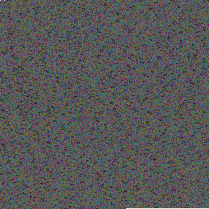
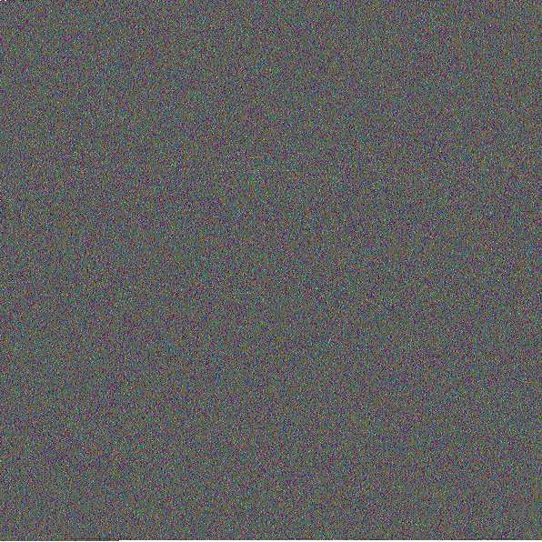
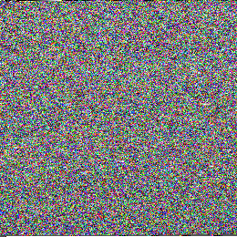

# Possum

Imagine if you could just convert any type of file (text, images, music...) into an image, just like a compressed file, but giving it a visual representation and an artistic touch as well. 
Well, that's basically what Possum is about.
  

In a nutshell, it uses the color of each pixel of an image to store binary data, whatever it is: text, still images, GIFs, audio and even small videos!
  

Let me give you an example:  
 
The image above, is the Book of Genesis, the first book of the Bible.
  
 
The image above, is Don Quixote, the most influential work of literature from the entire Spanish literary canon.
  
 
The image above, is the song of the intro of Breaking Bad.

## [Now that you know what's about, try it out.](https://jlxip.github.io/Possum)
  

## How does it work?
### Images and colors
The first thing you have to know about is how images work (if you already know this, [click here](#compression)): 
First of all, an image has dimensions which are usually measured in pixels (_e.g. 480x480, 640x480, etc._). 
These pixels are like really tiny squares that can have different colors. A bunch of pixels put together form an image, got it? 
Now, the color of a pixel is defined by its color code. 
Each color has its own color code, and there are a few ways to represent this. The easiest is RGB (_Red, Green, Blue_), in which a color is a value formed by 3 inner values (guess them: red, green and blue), these values go from 0 to 255. Nevertheless, in some images that allow it (such as PNG images) there is also a 4th value which is the opacity. 
So, different combinations of these values give different color codes that result in different colors. Easy, right?  
For example, the color red will be 100% red (255), 0% green (0) and 0% blue (0). 
And the color yellow will be 100% red (255), 100% green (255) and 0% blue (0).
  

### The compression
The application generates an array which contains every single byte of the input file. 
As we already know that a color can save up to 3 values (4 in theory, but not in practice), each value of red, green and blue is set with the decimal value of each pixel.  

Let me make this clear, if we have the following bytes: 
[104, 101, 108, 108, 111] 
We can convert them easily into the colors of two pixels: 
PIXEL 1 -> 104 red, 101 green, 108 blue 
PIXEL 2 -> 108 red, 111 green, 0 blue 
  

### The structure
Now you have to know that every single image generated by the application follows a structure (it's not mayhem), and it's manifested through different pixels.  

The structure is the following: 
The first pixel of the image, is an opaque (opacity of 100%) white pixel. It's used to check that the image can be read. 
The following pixels contain the MIME type (_text/plain_, _image/png_, etc.). 
Just after the MIME type, there is a reserved transparent pixel (opacity of 0%). 
After the reserved pixel, the content starts. 
The last pixel of the image is another transparent pixel, which tells the application that the content has finished. 
  